# 🔗 SIH_Fleet_Sim — Complete Codebase Flowchart (Source-Level)

> Every source file, every class, every function call chain — mapped as interactive Mermaid diagrams.  
> Generated from the actual codebase at `SIH_Fleet_Sim/src/`, `backend/`, and `frontend/`.

---

## 📑 Contents

1. [Master Module Dependency Graph](#1-master-module-dependency-graph)
2. [Entry Points & Execution Paths](#2-entry-points--execution-paths)
3. [50 Hz Simulation Main Loop (`main.py::run_scenario`)](#3-50-hz-simulation-main-loop-mainpyrun_scenario)
4. [`AMRBrain.step()` — The Complete Agent Tick](#4-amrbrainstep--the-complete-agent-tick)
5. [`World.step()` — Physics Integration & Collision Detection](#5-worldstep--physics-integration--collision-detection)
6. [`SimNetwork` — Message Transport & Fault Injection](#6-simnetwork--message-transport--fault-injection)
7. [Wire Protocol — Message Types & Serialization (`messages.py`)](#7-wire-protocol--message-types--serialization-messagespy)
8. [Path Planning Pipeline (`planner.py`)](#8-path-planning-pipeline-plannerpy)
9. [Topology Analysis & Directed Circulation (`topology.py`)](#9-topology-analysis--directed-circulation-topologypy)
10. [PIBT Priority Engine (`priority.py::pibt_step`)](#10-pibt-priority-engine-prioritypypibt_step)
11. [`BIOS_4` Neural Policy (`bios4.py`)](#11-bios_4-neural-policy-bios4py)
12. [Neuroevolution Training Loop (`evolve.py`)](#12-neuroevolution-training-loop-evolvepy)
13. [Fleet Manager — Central Baseline (`fleet_manager.py`)](#13-fleet-manager--central-baseline-fleet_managerpy)
14. [Metrics & Statistical Safety Analysis (`metrics.py`)](#14-metrics--statistical-safety-analysis-metricspy)
15. [Backend HTTP Server (`backend/server.py`)](#15-backend-http-server-backendserverpy)
16. [Frontend Canvas Engine (`frontend/js/`)](#16-frontend-canvas-engine-frontendjs)
17. [Complete Class Hierarchy & Data Flow](#17-complete-class-hierarchy--data-flow)

---

## 1. Master Module Dependency Graph

Every `import` relationship across the entire `src/` package and `backend/` server, showing which module depends on which.

```mermaid
flowchart TD
    classDef core fill:#1e293b,stroke:#3b82f6,stroke-width:2px,color:#fff;
    classDef brain fill:#312e81,stroke:#818cf8,stroke-width:2px,color:#fff;
    classDef infra fill:#14532d,stroke:#22c55e,stroke-width:2px,color:#fff;
    classDef entry fill:#7f1d1d,stroke:#ef4444,stroke-width:2px,color:#fff;
    classDef front fill:#451a03,stroke:#f59e0b,stroke-width:2px,color:#fff;

    geometry["geometry.py\n- Cell, Vec types\n- wrap_angle, dist, manhattan\n- segment_point_distance\n- segments_min_distance"]:::core

    settings["settings.py\n- RobotSpec (physics limits)\n- Rates (50/10/1 Hz)\n- TrafficSpec, NetSpec\n- Config (frozen dataclass)"]:::core

    environment["environment.py\n- Warehouse (grid, stations, docks)\n- classic_warehouse()\n- open_floor()\n- chokepoint_warehouse()\n- corridors()"]:::core

    topology["topology.py\n- TopologyMap (core, branches, roots)\n- analyse_topology()\n- directed_circulation()"]:::core

    planner["planner.py\n- Reservations (vertex/edge)\n- astar()\n- space_time_astar()\n- prioritized_plan()"]:::core

    messages["messages.py\n- Message dataclass\n- 12 message types\n- encode() / decode()\n- HMAC authentication\n- heartbeat(), intent(),\n  claim(), bid(), award()..."]:::infra

    transport["transport.py\n- ReplayWindow\n- SimNetwork (seeded lossy)\n- UdpMulticastTransport\n- dead-zone model"]:::infra

    task_allocation["task_allocation.py\n- ALLOCATION_AUCTION\n- ALLOCATION_HUNGARIAN\n- ALLOCATION_PREASSIGNED\n- validate_allocation_policy()"]:::core

    assignment["assignment.py\n- hungarian() O(n^3)"]:::core

    priority["priority.py\n- PriorityKey (7-tuple)\n- StepDecision\n- pibt_step()"]:::brain

    world["world.py\n- Actuation, Sensors, Detection\n- RobotState, HumanState\n- ContactEvent\n- World (physics referee)"]:::brain

    amr["amr.py (2893 lines)\n- Task, Peer dataclasses\n- AMRBrain class\n  - step(), _safety()\n  - _traffic_loop()\n  - _route_loop()\n  - _task_loop()\n  - _follow(), _broadcast()"]:::brain

    bios4["bios4.py\n- PolicyNet (MLP)\n- FEATURES (28)\n- ACTIONS (5 verbs)\n- model_from_json()\n- random_model()"]:::brain

    fleet_manager["fleet_manager.py\n- FleetManager class\n  - step(), kill()\n  - prioritized_plan\n  - hungarian assignment"]:::brain

    scenarios["scenarios.py\n- Scenario dataclass\n- ObstacleEvent\n- SCENARIOS registry\n- workload_fingerprint()"]:::infra

    metrics["metrics.py\n- PolicyResult (40+ fields)\n- poisson_rate_ci()\n- safety_report()\n- compare()"]:::infra

    main["main.py\n- run_scenario()\n- run_for_dashboard()\n- main() CLI"]:::entry

    evolve["evolve.py\n- evolve()\n- fitness function\n- ProcessPoolExecutor\n- TRAIN_SEEDS / EVAL_SEEDS"]:::entry

    server["backend/server.py\n- Handler (HTTP)\n- serve()\n- /api/scenarios\n- /api/run"]:::entry

    frontend["frontend/js/\n- main.js (App shell)\n- amr.js (View class)\n- environment.js\n- hud.js\n- network.js"]:::front

    %% Dependencies
    geometry --> environment
    geometry --> world
    geometry --> planner
    geometry --> priority
    geometry --> amr
    geometry --> topology
    geometry --> messages
    geometry --> scenarios

    settings --> world
    settings --> amr
    settings --> transport
    settings --> fleet_manager
    settings --> scenarios
    settings --> main

    environment --> topology
    environment --> planner
    environment --> priority
    environment --> world
    environment --> amr
    environment --> fleet_manager
    environment --> scenarios

    topology --> amr
    planner --> amr
    planner --> fleet_manager
    priority --> amr
    messages --> transport
    messages --> amr
    messages --> fleet_manager
    messages --> main
    transport --> main
    task_allocation --> amr
    task_allocation --> main
    task_allocation --> fleet_manager
    task_allocation --> scenarios
    assignment --> fleet_manager
    world --> main
    amr --> main
    amr --> evolve
    bios4 --> amr
    bios4 --> evolve
    fleet_manager --> main
    scenarios --> main
    scenarios --> evolve
    metrics --> main
    metrics --> evolve
    main --> server
    main --> evolve
```

---

## 2. Entry Points & Execution Paths

Three distinct ways to launch the system, all converging on the same `AMRBrain` and `World`.

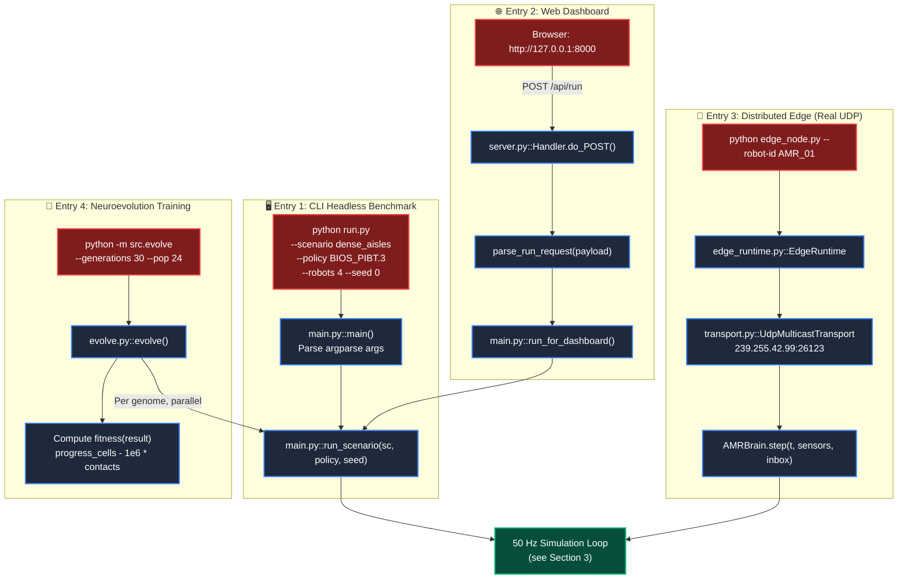

---

## 3. 50 Hz Simulation Main Loop (`main.py::run_scenario`)

The exact sequence of operations inside each simulation tick, mapped line-by-line to the source code.

```mermaid
flowchart TD
    classDef init fill:#1e293b,stroke:#3b82f6,stroke-width:2px,color:#fff;
    classDef tick fill:#0f172a,stroke:#10b981,stroke-width:2px,color:#fff;
    classDef cond fill:#172554,stroke:#60a5fa,stroke-width:2px,color:#fff;

    Start["run_scenario(sc, policy, seed)\nmain.py L98"]:::init

    Start --> CreateWorld["world = World(sc.env, cfg, seed)\nmain.py L116"]:::init
    CreateWorld --> CreateNet["net = SimNetwork(cfg, seed)\nmain.py L117"]:::init
    CreateNet --> CreateBrains["for i, start in sc.starts:\n  brains[rid] = AMRBrain(rid, sc.env, cfg, policy)\n  world.add_robot(rid, start)\nmain.py L122-133"]:::init
    CreateBrains --> AddHumans["for walk in sc.humans:\n  world.add_human(hid, walk)\nmain.py L135-136"]:::init
    AddHumans --> CreateManager["if policy in MANAGED_POLICIES:\n  manager = FleetManager(sc.env, cfg)\nmain.py L141-149"]:::init

    CreateManager --> TickLoop["for k in range(steps):\n  t = k * dt   (dt = 1/50 = 0.02s)\nmain.py L162-163"]:::tick

    TickLoop --> Step1["STEP 1: Scripted World Events\n- Kill fleet manager at t?\n- Network partition at t?\n- Robot hardware fail at t?\n- Spawn/clear dynamic obstacles?\nmain.py L165-201"]:::cond

    Step1 --> Step2["STEP 2: WMS Task Announcements\nif uses_allocation and t >= next_wms_announcement:\n  for tk in announced_tasks:\n    net.send(t, WMS_ID, msg.task_new(...))\nmain.py L203-216"]:::tick

    Step2 --> Step3["STEP 3: Fleet Manager Tick\nif manager is not None:\n  out = manager.step(t, net.poll(t, MANAGER_ID))\n  for m in out: net.send(t, MANAGER_ID, m)\nmain.py L218-223"]:::tick

    Step3 --> Step4["STEP 4: Every Robot Tick (sorted order)\nfor rid in sorted(brains):\n  sensors = world.sense(rid)\n  act, outbox = brains[rid].step(t, sensors, net.poll(t, rid))\n  for m in outbox: net.send(t, rid, m)\n  cmds[rid] = act\nmain.py L225-245"]:::tick

    Step4 --> Step5["STEP 5: World Physics Integration\nworld.step(dt, cmds)\n- Kinematics dx/dy/dtheta\n- Battery discharge\n- Human worker updates\n- Swept collision checks\nmain.py L247"]:::tick

    Step5 --> Step6["STEP 6: Telemetry Snapshot (if trace)\nif k % (world_hz / telemetry_hz) == 0:\n  snap = world.snapshot()\n  snap['fleet'] = [{id, state, task, path...}]\n  trace.append(snap)\nmain.py L249-274"]:::tick

    Step6 --> CheckDone{"All tasks completed?\nmain.py L276-279"}:::cond

    CheckDone -- No --> TickLoop
    CheckDone -- Yes --> Finalize["world.finalize()\nreturn _summarize(...) -> PolicyResult\nmain.py L281-347"]:::init
```

---

## 4. `AMRBrain.step()` — The Complete Agent Tick

Every method call inside one `AMRBrain.step()` invocation, showing the three control loop timescales and their actual source locations.

```mermaid
flowchart TD
    classDef entry fill:#312e81,stroke:#818cf8,stroke-width:2px,color:#fff;
    classDef l0 fill:#831843,stroke:#f43f5e,stroke-width:2px,color:#fff;
    classDef l1 fill:#1e293b,stroke:#3b82f6,stroke-width:2px,color:#fff;
    classDef l2 fill:#064e3b,stroke:#10b981,stroke-width:2px,color:#fff;
    classDef l3 fill:#451a03,stroke:#f59e0b,stroke-width:2px,color:#fff;

    StepEntry["AMRBrain.step(t, sensors, inbox)\namr.py L275\nReturns: (Actuation, list[Message])"]:::entry

    StepEntry --> Ingest["self._ingest(t, inbox)\n- Parse HEARTBEAT → update peers[]\n- Parse INTENT → update peer.intent\n- Parse CLAIM/RELEASE → update _claims{}\n- Parse AWARD → mark _awarded set\n- Parse BID → accumulate _bids{}\n- Parse TASK_NEW → add to open_tasks{}\n- Parse TASK_DONE → mark completed_tasks\n- Parse MGR_BEACON → set mode=CENTRAL_OK\n- Parse PLAN_RSP → set path/path_times\namr.py ~L550-850"]:::l1

    Ingest --> ExpirePeers["self._expire_peers(t)\n- Drop peers with last_seen > 5.0s\namr.py"]:::l1

    ExpirePeers --> ExpireClaims["self._expire_task_claims(t)\n- Expire auction leases past TTL\namr.py"]:::l1

    ExpireClaims --> DynObstacles["self._observe_dynamic_obstacles(t, sensors)\n- Convert stationary lidar returns to local blocked cells\n- Trigger dynamic_reroutes stat counter\namr.py"]:::l1

    DynObstacles --> TaskLoop["self._task_loop(t, sensors, outbox)\n- STATE MACHINE: idle→to_pick→to_drop→idle\n- If AUCTION: compute bid cost, broadcast BID\n- If HUNGARIAN: wait for AWARD from manager\n- If PREASSIGNED: pop next from self.queue\n- Drop admission: max 2 robots per drop cell\n- Broadcast TASK_DONE on completion\namr.py ~L900-1200"]:::l3

    TaskLoop --> RouteCheck{"t - _t_route >= 1.0 / route_hz?\n(Default: 1 Hz)\namr.py L300"}:::l2

    RouteCheck -- Yes --> RouteLoop["self._route_loop(t, sensors, outbox)\n- If CENTRAL and manager alive:\n    Send PLAN_REQ\n- Else:\n    path = planner.astar(env, cell, goal,\n      extra_cost=self.penalty,\n      edge_allowed=circulation)\n    pidx = 0\namr.py ~L1300-1500"]:::l2

    RouteCheck -- No --> TrafficCheck

    RouteLoop --> TrafficCheck{"t - _t_reactive >= 1.0 / reactive_hz?\n(Default: 10 Hz)\namr.py L304"}:::l1

    TrafficCheck -- Yes --> TrafficLoop["self._traffic_loop(t, sensors, outbox)\n- Compute PriorityKey (7-tuple)\n- If PIBT policy:\n    Run priority.pibt_step()\n    → StepDecision (next_cells, inheritances)\n- If BIOS_1.0.0:\n    Evaluate _bios_traffic() heuristics\n- If BIOS_4:\n    Extract 28-dim feature vector\n    Forward through PolicyNet\n    → action ∈ {proceed, hold, yield, claim, reroute}\n- Apply cell lease 2-phase gate\n- Detect & break deadlocks\namr.py ~L1600-2200"]:::l1

    TrafficCheck -- No --> BiosClaim

    TrafficLoop --> BiosClaim["if DECENTRAL_POLICIES:\n  self._bios_claim(t, sensors, next_cell, outbox)\n  - Corridor block token management\n  - Broadcast CLAIM / RELEASE messages\namr.py L308-311"]:::l1

    BiosClaim --> Follow["act = self._follow(t, sensors)\n- Trajectory follower: turn-then-drive\n- Compute desired (v, omega) toward next waypoint\n- Speed profile: cruise / approach / turn_in_place\namr.py ~L2300-2500"]:::l2

    Follow --> Safety["act = self._safety(sensors, act)\n- Layer 0: FINAL AUTHORITY\n- Read clearance_omni_m, clearance_dynamic_m\n- Compute stop_field_m(v) = v²/2a + v·t_react + margin\n- If obstacle in cone <= d_stop: HARD STOP\n- If omni <= 0.30m: PROTECTIVE STOP\n- Else: allow or proportional scale\namr.py L337-405"]:::l0

    Safety --> Broadcast{"t - _t_hb >= 1.0 / heartbeat_hz?\namr.py L326"}:::l1

    Broadcast -- Yes --> DoBroadcast["self._broadcast(t, sensors, outbox)\n- Emit HEARTBEAT (pose, battery, state)\n- Emit INTENT (next K cells + time windows)\n- Emit CLAIM if holding block token\n- Gossip: TASK_NEW catalog entries\n- Gossip: TASK_DONE completions\namr.py ~L2600-2800"]:::l1

    Broadcast -- No --> Return

    DoBroadcast --> Return["return (act, outbox)\namr.py L333"]:::entry
```

---

## 5. `World.step()` — Physics Integration & Collision Detection

```mermaid
flowchart TD
    classDef phys fill:#1e293b,stroke:#3b82f6,stroke-width:2px,color:#fff;
    classDef col fill:#7f1d1d,stroke:#ef4444,stroke-width:2px,color:#fff;

    Entry["World.step(dt, cmds)\nworld.py L211"]:::phys

    Entry --> SavePrev["prev = {rid: (x,y) for each robot}\nprev_h = {hid: (x,y) for each human}\nworld.py L213-214"]:::phys

    SavePrev --> RobotLoop["for rid, st in self.robots.items():\nworld.py L216"]:::phys

    RobotLoop --> RateLimit["Rate-limit actuation to envelope:\ndv = clamp(cmd.v - st.v, -a_max*dt, a_max*dt)\nst.v = clamp(st.v + dv, -0.35*v_max, v_max)\ndw = clamp(cmd.omega - st.omega, ...)\nworld.py L224-227"]:::phys

    RateLimit --> Integrate["Euler integration:\nnx = st.x + st.v * cos(theta) * dt\nny = st.y + st.v * sin(theta) * dt\nntheta = wrap_angle(theta + omega * dt)\nworld.py L229-231"]:::phys

    Integrate --> RackCheck{"_hits_rack((nx, ny))?\nworld.py L233"}:::col

    RackCheck -- Yes --> RackContact["Record robot-rack contact\nst.v = 0.0 (dead stop)\nworld.py L236-238"]:::col

    RackCheck -- No --> UpdatePose["st.x, st.y, st.theta = nx, ny, ntheta\nst.dist_travelled += hypot(...)\nworld.py L240-241"]:::phys

    RackContact --> Battery
    UpdatePose --> Battery

    Battery["Battery model:\nif on_dock: charge at charge_w\nelse: drain at draw_move_w or draw_idle_w\nworld.py L243-249"]:::phys

    Battery --> HumanStep["for human in self.humans.values():\n  human.step(dt)\n  - Walk toward next waypoint\n  - Advance idx on arrival\nworld.py L251-252"]:::phys

    HumanStep --> PairwiseRR["Robot-Robot swept collision:\nfor (a, b) in pairs:\n  d_min = segments_min_distance(\n    prev[a], (a.x,a.y), prev[b], (b.x,b.y))\n  if d_min < 2 * radius_m:\n    _record(t, 'robot-robot', a, b, d_min)\n  _pair_min update\nworld.py L258-280"]:::col

    PairwiseRR --> PairwiseRH["Robot-Human swept collision:\nfor robot, human in cross_product:\n  d_min = segments_min_distance(...)\n  if d_min < robot.radius + human.radius:\n    _record(t, 'robot-human', ...)\nworld.py L282-300"]:::col

    PairwiseRH --> UpdateTime["self.t += dt\nworld.py L306"]:::phys

    UpdateTime --> Return["return self.contacts (new events this tick)"]:::phys
```

---

## 6. `SimNetwork` — Message Transport & Fault Injection

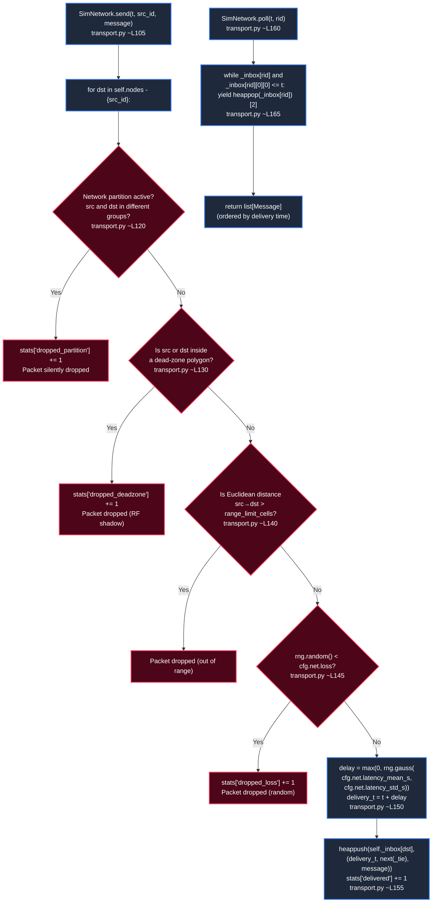

---

## 7. Wire Protocol — Message Types & Serialization (`messages.py`)

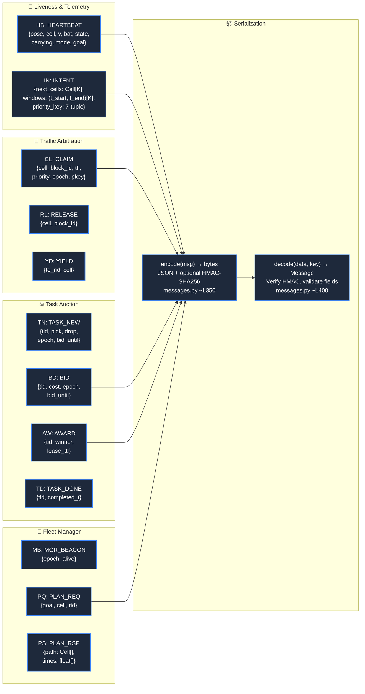

---

## 8. Path Planning Pipeline (`planner.py`)

```mermaid
flowchart TD
    classDef plan fill:#1e293b,stroke:#3b82f6,stroke-width:2px,color:#fff;

    subgraph AStar ["planner.py::astar()  —  Layer 2 Default"]
        A1["Input: env, start, goal,\nextra_cost, blocked, edge_allowed\nplanner.py L73"]:::plan
        A2["Priority queue: heapq\nf(n) = g(n) + h(n)\nh = manhattan(n, goal)\nplanner.py L90-95"]:::plan
        A3["Expand 4-connected neighbors:\nfor nb in env.neighbors(current):\n  if edge_allowed and not edge_allowed(current, nb): skip\n  cost = 1.0 + extra_cost.get(nb, 0)\nplanner.py L100-115"]:::plan
        A4["Reconstruct path via came_from{}\nreturn list[Cell]\nplanner.py L120"]:::plan
        A1 --> A2 --> A3 --> A4
    end

    subgraph SpaceTimeAStar ["planner.py::space_time_astar()  —  Manager"]
        S1["Input: env, start, goal,\nreservations, max_t\nplanner.py L130"]:::plan
        S2["State = (cell, timestep t)\nf(n) = g(n) + h(n)\nh = manhattan(cell, goal)\nplanner.py L140"]:::plan
        S3["Expand neighbors AND wait-in-place:\nfor nb in env.neighbors(cell) + [cell]:\n  if not reservations.vertex_free(nb, t+1, who): skip\n  if not reservations.edge_free(cell, nb, t, who): skip\nplanner.py L150-165"]:::plan
        S4["Reconstruct → TimedPlan: list[(Cell, int)]\nplanner.py L170"]:::plan
        S1 --> S2 --> S3 --> S4
    end

    subgraph Prioritized ["planner.py::prioritized_plan()  —  Multi-Robot"]
        P1["Input: env, goals: dict[rid, Cell],\npositions: dict[rid, Cell]\nplanner.py L180"]:::plan
        P2["Sort robots by priority\nreservations = Reservations()\nplanner.py L185"]:::plan
        P3["for rid in priority_order:\n  path = space_time_astar(env, pos[rid], goal[rid], reservations)\n  reservations.reserve_path(rid, path)\nplanner.py L190-200"]:::plan
        P1 --> P2 --> P3
    end
```

---

## 9. Topology Analysis & Directed Circulation (`topology.py`)

```mermaid
flowchart TD
    classDef topo fill:#1e293b,stroke:#3b82f6,stroke-width:2px,color:#fff;

    subgraph AnalyseTopology ["topology.py::analyse_topology(env)"]
        T1["Input: Warehouse env\ntopology.py L44"]:::topo
        T2["Build adjacency: neighbors{v} for all free cells\nCompute degree{v}\ntopology.py L46-48"]:::topo
        T3["2-Core Peeling:\nqueue = [v for v if degree < 2]\nwhile queue:\n  remove v, decrement neighbor degrees\n  if neighbor degree drops to 1: enqueue\ntopology.py L49-64"]:::topo
        T4["core = vertices - removed\nBFS flood-fill on removed → branches{}\nroots{bid} = cells adjacent to core\ntopology.py L66-95"]:::topo
        T5["Return TopologyMap(\n  core, branch_of, branches, roots)\ntopology.py L100"]:::topo
        T1 --> T2 --> T3 --> T4 --> T5
    end

    subgraph DirectedCirculation ["topology.py::directed_circulation(env)"]
        D1["Input: Warehouse env\ntopology.py L120"]:::topo
        D2["For each rack aisle row:\n  Assign alternating East/West direction\nFor each rack aisle column:\n  Assign alternating North/South direction\ntopology.py L130-160"]:::topo
        D3["Verify strong connectivity (BFS from every cell)\nReturn edge_allowed: Callable[[Cell, Cell], bool]\ntopology.py L170-200"]:::topo
        D1 --> D2 --> D3
    end
```

---

## 10. PIBT Priority Engine (`priority.py::pibt_step`)

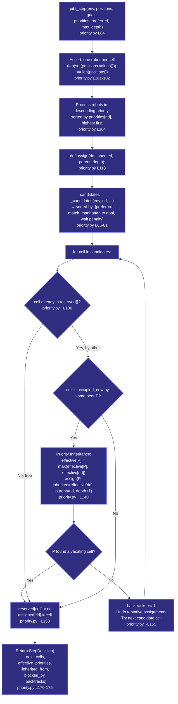

---

## 11. `BIOS_4` Neural Policy (`bios4.py`)

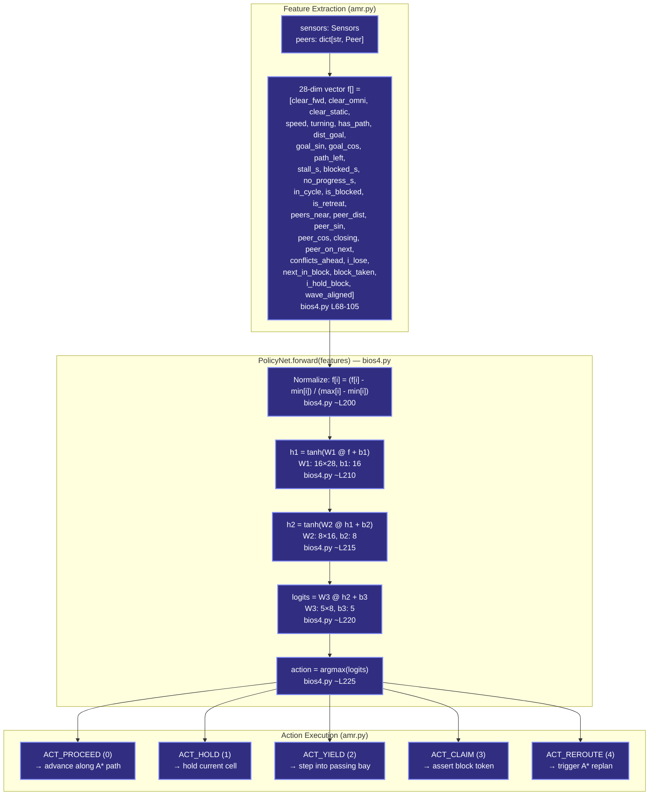

---

## 12. Neuroevolution Training Loop (`evolve.py`)

```mermaid
flowchart TD
    classDef evo fill:#451a03,stroke:#f59e0b,stroke-width:2px,color:#fff;

    Start["evolve(generations, pop_size, episodes,\nscenario, on_generation, cancel)\nevolve.py ~L120"]:::evo

    Start --> InitPop["population = [random_model(seed=i)\nfor i in range(pop_size)]\nevolve.py ~L140"]:::evo

    InitPop --> GenLoop["for gen in range(generations):"]:::evo

    GenLoop --> Evaluate["ProcessPoolExecutor.map(\n  _evaluate_genome, population)\n\ndef _evaluate_genome(model):\n  total_fitness = 0\n  for (seed, duration) in episodes:\n    sc = SCENARIOS[scenario](seed=seed)\n    result = run_scenario(sc, 'BIOS_4',\n      seed=seed, policy_model=model)\n    total_fitness += fitness(result)\n  return total_fitness\nevolve.py ~L160-190"]:::evo

    Evaluate --> FitnessCalc["fitness(result: PolicyResult) =\n  result.progress_cells\n  + 1000 * result.tasks_completed\n  - 1_000_000 * result.contacts_robot_robot\n  - 500 * result.deadlocks_detected\nevolve.py ~L80-100"]:::evo

    FitnessCalc --> Rank["Sort population by fitness (descending)\nevolve.py ~L200"]:::evo

    Rank --> Select["Keep top elite_k genomes\nevolve.py ~L205"]:::evo

    Select --> Reproduce["For remaining pop_size - elite_k:\n  parent = tournament_select(top_half)\n  child = mutate(parent, sigma=mutation_std)\nevolve.py ~L210-230"]:::evo

    Reproduce --> Callback["on_generation(gen, best_model, best_fitness)\nevolve.py ~L240"]:::evo

    Callback --> CheckCancel{"cancel() is True?\nevolve.py ~L245"}:::evo

    CheckCancel -- Yes --> EarlyStop["Return best model found so far"]:::evo
    CheckCancel -- No --> GenLoop
```

---

## 13. Fleet Manager — Central Baseline (`fleet_manager.py`)

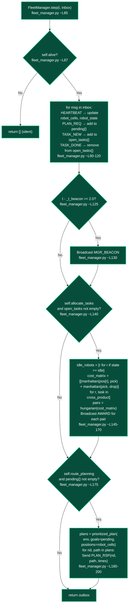

---

## 14. Metrics & Statistical Safety Analysis (`metrics.py`)

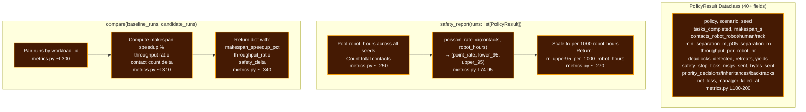

---

## 15. Backend HTTP Server (`backend/server.py`)

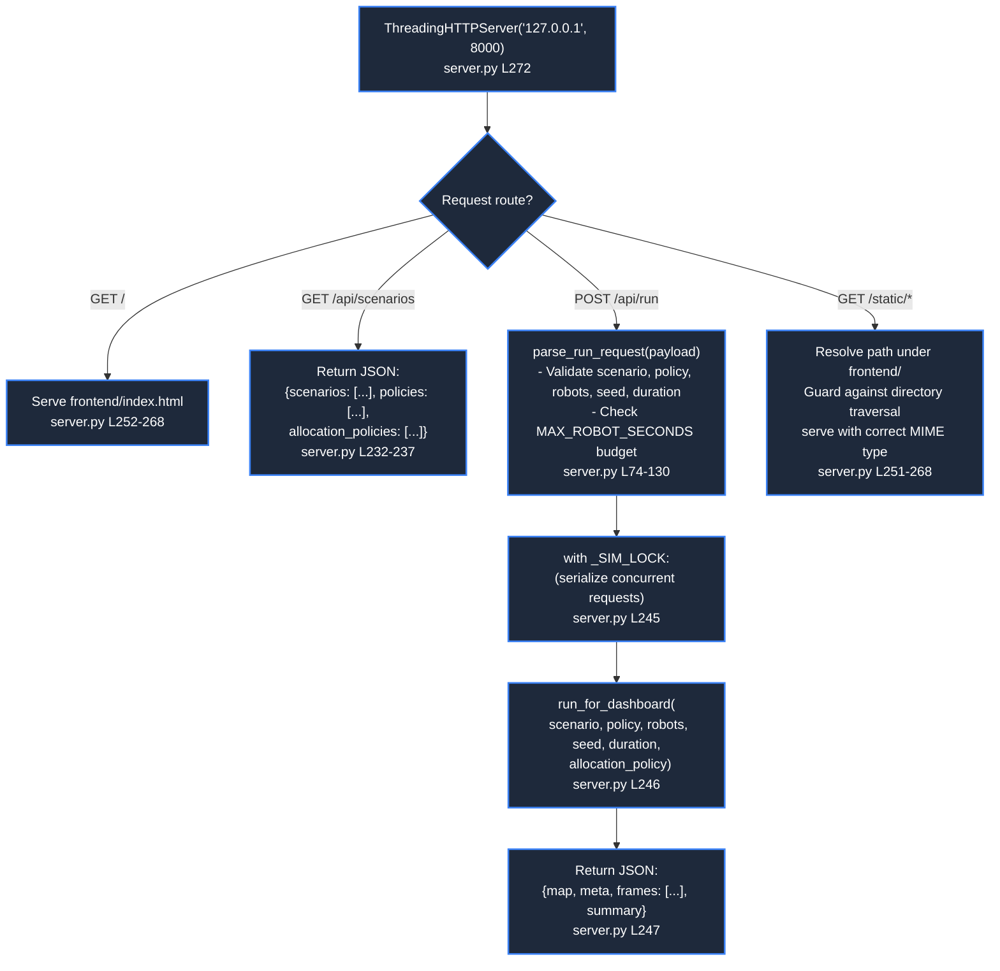

---

## 16. Frontend Canvas Engine (`frontend/js/`)

```mermaid
flowchart TD
    classDef fe fill:#451a03,stroke:#f59e0b,stroke-width:2px,color:#fff;

    subgraph MainJS ["main.js — App Shell (705 lines)"]
        Boot["boot()\n- Init View (Canvas 2D)\n- Fetch /api/scenarios\n- Bind UI controls\n- Keyboard shortcuts\nmain.js L33-94"]:::fe

        Run["run()\n- POST /api/run\n- Receive {map, frames, summary}\n- Build static layer\n- Start playback\nmain.js ~L105-180"]:::fe

        Draw["draw()\n- Interpolate simTime between frames\n- Apply camera transform\n- Render layers\n- Update HUD stats\nmain.js ~L200-350"]:::fe

        Camera["Camera system:\n- setCameraMode(overview/follow/pov)\n- selectRobot(id)\n- adjustZoom(delta)\n- PiP viewfinder toggle\nmain.js L60-74"]:::fe

        Boot --> Run --> Draw
        Camera --> Draw
    end

    subgraph AmrJS ["amr.js — View Class (renderer)"]
        ViewClass["class View\n- constructor(canvas)\n- resize(map, cell_m)\n- clear(), save(), restore()\n- toWorld(x,y), fromWorld(x,y)\namr.js ~L1-80"]:::fe

        DrawRobot["drawRobot(robot, imgs)\n- Chassis body (rotated rect)\n- HALO status ring (color-coded glow)\n- Payload crate sprite\n- LiDAR arc sweep\namr.js ~L100-200"]:::fe

        DrawLinks["drawPeerLinks(fleet)\n- P2P multicast mesh lines\n- Color by signal strength\namr.js ~L220-260"]:::fe

        ViewClass --> DrawRobot
        ViewClass --> DrawLinks
    end

    subgraph EnvJS ["environment.js — Map Renderer"]
        DrawGrid["drawGrid(map, cell_m)\n- Floor tiles, rack blocks\n- Station markers (pick/drop)\n- Charging docks\n- Heatmap overlay\nenvironment.js ~L1-200"]:::fe

        DrawCirculation["drawCirculation(map)\n- One-way directed arrows\n- Aisle flow indicators\nenvironment.js ~L200-300"]:::fe
    end

    subgraph HudJS ["hud.js — Dashboard Overlay (26k)"]
        Stats["updateStats(summary)\n- Collisions, throughput, makespan\n- Safety index (Poisson rate)\nhud.js ~L1-100"]:::fe

        Inspector["updateInspector(robot)\n- Battery bar, state label\n- Priority key display\n- Active task & lease\nhud.js ~L100-200"]:::fe

        AuctionLog["updateAuctionLog(events)\n- Scrolling event feed\n- BID / AWARD / TASK_DONE markers\nhud.js ~L200-300"]:::fe
    end

    subgraph NetworkJS ["network.js — Comm Visualization"]
        MeshOverlay["drawMeshOverlay(fleet)\n- Animated dotted lines\n- Intent vector arrows\n- Signal strength opacity\nnetwork.js ~L1-150"]:::fe
    end
```

---

## 17. Complete Class Hierarchy & Data Flow

Every major class and dataclass in the codebase, showing ownership and data flow.

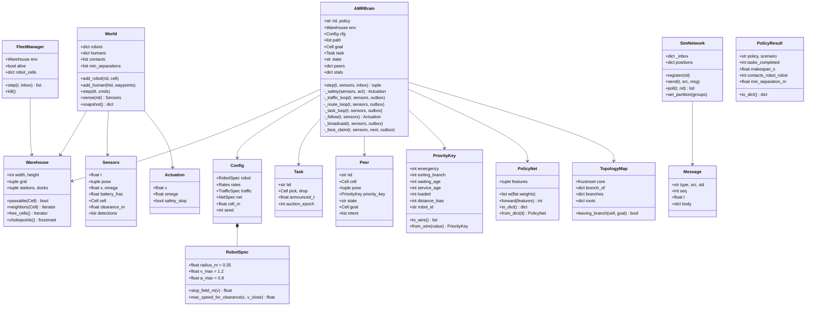

---

*Generated from the actual source code of `SIH_Fleet_Sim` (SIH26123).*
