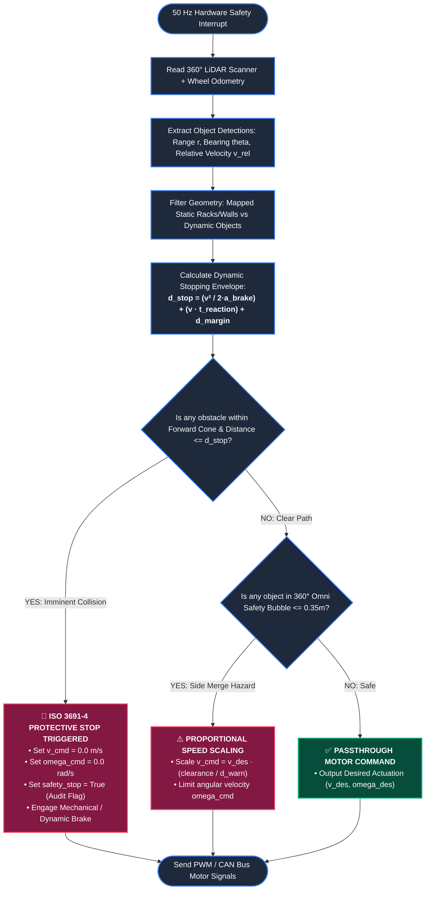
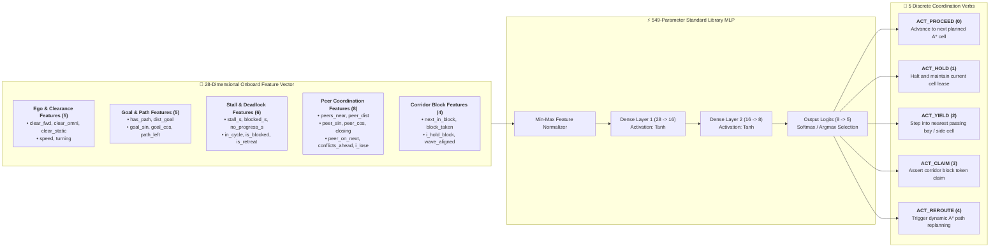
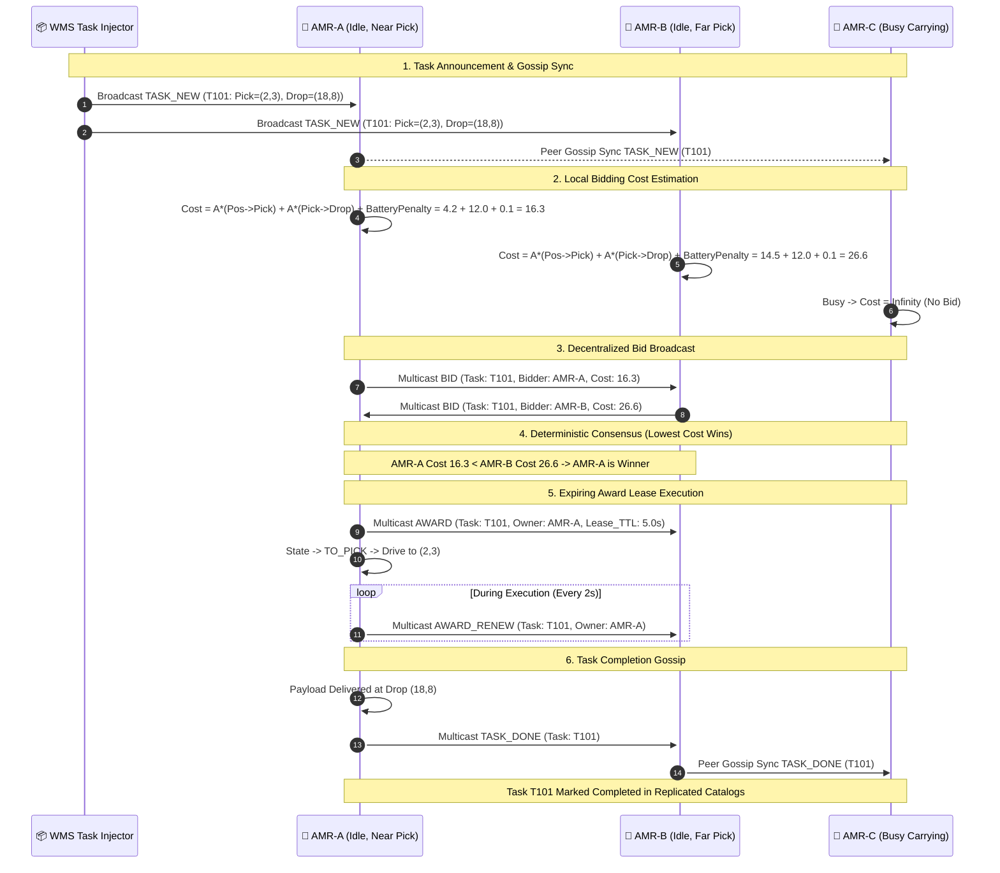

# 🗺️ SIH_Fleet_Sim — Complete System Flowcharts & Architectural Diagrams

> **Autonomous Mobile Robot (AMR) Edge-AI Fleet Coordination System**  
> **Project:** `SIH_Fleet_Sim` | **Protocol:** `BIOS_PIBT.3` / `BIOS_4` | **Standard:** ISO 3691-4 Compliant  

---

## 📑 Flowchart Index

1. [Parental Master Flowchart: End-to-End System Lifecycle](#1-parental-master-flowchart-end-to-end-system-lifecycle)
2. [Layer 0: Kinematics & ISO 3691-4 Certified Safety Loop (50 Hz)](#2-layer-0-kinematics--iso-3691-4-certified-safety-loop-50-hz)
3. [Layer 1: Decentralized Traffic Negotiation & Priority Arbitration (`BIOS_PIBT.3`)](#3-layer-1-decentralized-traffic-negotiation--priority-arbitration-bios_pibt3)
4. [Layer 1 (Learned): `BIOS_4` Neuroevolution Policy & Action Engine](#4-layer-1-learned-bios_4-neuroevolution-policy--action-engine)
5. [Layer 2: Warehouse Topology, Directed Circulation & Space-Time $A^*$ Routing](#5-layer-2-warehouse-topology-directed-circulation--space-time-a-routing)
6. [Layer 3: Decentralized Task Allocation & Contract Net Auction Market](#6-layer-3-decentralized-task-allocation--contract-net-auction-market)
7. [Transport & Comms Mesh: Dual-Mode Network & Fault Injection](#7-transport--comms-mesh-dual-mode-network--fault-injection)
8. [Ground Truth Simulation Referee & Dynamic Entities](#8-ground-truth-simulation-referee--dynamic-entities)
9. [Frontend Visualizer, Multi-Camera Subsystem & HUD Analytics Engine](#9-frontend-visualizer-multi-camera-subsystem--hud-analytics-engine)
10. [Edge Hardware Deployment & Sim-to-Real Execution Flow](#10-edge-hardware-deployment--sim-to-real-execution-flow)

---

## 1. Parental Master Flowchart: End-to-End System Lifecycle

This master flowchart illustrates the complete lifecycle from system initialization, topology compilation, agent bootstrapping, and order injection, through the multi-rate distributed control loops (50 Hz, 10 Hz, 1 Hz), peer gossip mesh, physics evaluation, to the real-time HTML5 Canvas visualizer and statistical benchmark generation.

```mermaid
flowchart TD
    classDef init fill:#1e293b,stroke:#3b82f6,stroke-width:2px,color:#fff;
    classDef loop fill:#0f172a,stroke:#10b981,stroke-width:2px,color:#fff;
    classDef net fill:#1e1e38,stroke:#8b5cf6,stroke-width:2px,color:#fff;
    classDef safety fill:#3b0764,stroke:#ec4899,stroke-width:2px,color:#fff;
    classDef viz fill:#182747,stroke:#06b6d4,stroke-width:2px,color:#fff;
    classDef metric fill:#2d1b00,stroke:#f59e0b,stroke-width:2px,color:#fff;

    subgraph Phase1 ["🚀 1. SYSTEM INITIALIZATION & TOPOLOGY PARSING"]
        Start([System Launch: server.py / run.py / edge_runtime.py]):::init --> LoadConfig[Load Config & Parameters\n- Grid Dims, Speed Limits, Battery Specs\n- Policy: BIOS_PIBT.3 / Central / Stop-Wait]:::init
        LoadConfig --> BuildMap[Generate Warehouse Environment\n- Racks, Aisles, Walls, Pickup/Drop Stations\n- Charging Docks & Human Worker Paths]:::init
        BuildMap --> DecomposeGraph[Topological Graph Analysis\n- Directed Circulation Decomposition\n- Chokepoints, Single-File Blocks & Bridge Detection]:::init
        DecomposeGraph --> InitFleet[Instantiate AMR Agents & Hardware Sockets\n- Allocate Robot IDs, Home Cells, Inboxes/Outboxes\n- Bind UDP Multicast Sockets on 239.255.42.99:26123]:::init
    end

    subgraph Phase2 ["📦 2. WMS TASK GENERATION & AUCTION LAYER (Layer 3)"]
        WMS[WMS / Task Injector]:::net -->|Broadcast TASK_NEW| ReplicatedCatalog[Replicated Task Catalog\n- Peer Gossip Synchronization\n- Drop Admission Capping: Max 2]:::net
        ReplicatedCatalog --> AuctionRound[Decentralized Batch Auction\n- Idle AMRs Compute Bid Cost: A* Dist + Battery\n- Broadcast BID & Agree on Award Leases]:::net
        AuctionRound --> AssignGoal[Winning AMR Sets Pick/Drop Goal]:::net
    end

    subgraph Phase3 ["🗺️ 3. GLOBAL ROUTE PLANNING LAYER (Layer 2 - 1 Hz)"]
        AssignGoal --> PlanRoute{Is Central Server Available?}:::loop
        PlanRoute -- Yes (Hierarchical) --> CentralAStar[Global Space-Time A* Reservation Table]:::loop
        PlanRoute -- No (Decentralized) --> LocalAStar[Onboard Space-Time A* Search\n- Directed One-Way Circulation Graph\n- Generate Waypoint Sequence]:::loop
        CentralAStar --> Waypoints[Active Target Waypoint]:::loop
        LocalAStar --> Waypoints
    end

    subgraph Phase4 ["🤝 4. LOCAL TRAFFIC & PRIORITY ARBITRATION (Layer 1 - 10 Hz)"]
        Waypoints --> ReadInbox[Read Multicast Inbox\n- Extract Peer Heartbeats, Intent & Leases]:::loop
        ReadInbox --> CalcPriority[Compute Dynamic Priority Key\n- Key = -DistToGoal, WaitTime, Battery, RobotID]:::loop
        CalcPriority --> PIBT_Engine[Execute BIOS_PIBT.3 Engine\n- Destination Cell 2-Phase Lease Claim\n- Priority Inheritance & Push Recursive Vacate\n- Single-File Block Directional Wave Check]:::loop
        PIBT_Engine --> GenDesiredActuation[Generate Desired Actuation (v_des, omega_des)\n- Trajectory Follower / Turning / Cruising]:::loop
    end

    subgraph Phase5 ["🛡️ 5. CERTIFIED LOCAL SAFETY LAYER (Layer 0 - 50 Hz Onboard)"]
        GenDesiredActuation --> SafetyCheck[Read 360° LiDAR Range Sweeps & Detections]:::safety
        SafetyCheck --> DynBraking[Calculate Required Stopping Distance\nd_stop = v^2 / 2*a_brake + v*t_react + margin]:::safety
        DynBraking --> BreachCheck{Obstacle Inside d_stop Safety Envelope?}:::safety
        BreachCheck -- Yes --> HardEStop[🚨 HARD PROTECTIVE STOP\nOverride Actuation to v=0, omega=0]:::safety
        BreachCheck -- No --> AllowActuation[Permit Scaled Desired Actuation]:::safety
        HardEStop --> FinalCommand[Final Motor Actuation]:::safety
        AllowActuation --> FinalCommand
    end

    subgraph Phase6 ["⚙️ 6. PHYSICAL WORLD GROUND TRUTH & DYNAMICS"]
        FinalCommand --> PhysicsReferee[World Kinematics & Numerical Integration\n- Differential Drive dx/dt, dy/dt, dtheta/dt\n- Payload Weight & Battery Discharge]:::loop
        PhysicsReferee --> DynamicWorkers[Simulate Dynamic Human Workers\n- Waypoint Navigation & Random Walk]:::loop
        DynamicWorkers --> SweptCollision[Continuous Swept-Polygon Collision Check\n- Minimum Distance to Racks, Walls, Humans, Peers]:::loop
    end

    subgraph Phase7 ["📡 7. TELEMETRY STREAMING & VISUALIZATION"]
        SweptCollision --> TelemetryPack[Construct Frame Snapshot JSON\n- Positions, Headings, Halos, Intents, Mesh Links]:::viz
        TelemetryPack --> WebSocketServer[WebSocket Server (Port 8000)]:::viz
        WebSocketServer --> BrowserClient[Browser Canvas 2D Engine\n- Sub-Pixel Position Interpolation\n- Slerp Angular Smoothing (60 FPS)\n- Multi-Camera Views: Overview, Follow, POV, PiP]:::viz
    end

    subgraph Phase8 ["📊 8. STATISTICAL BENCHMARKING & METRICS"]
        SweptCollision --> MetricsLogger[Statistical Metrics Aggregator\n- Poisson Collision Rate with 95% Confidence\n- Task Throughput, Makespan, Deadlock Counts\n- Energy Consumption (Watt-Hours)]:::metric
        MetricsLogger --> SimDone{Simulation Finished?}:::metric
        SimDone -- No --> Phase2
        SimDone -- Yes --> ExportReport([Generate Final Report & CSV/Plots]):::metric
    end

    Phase1 --> Phase2
```

---

## 2. Layer 0: Kinematics & ISO 3691-4 Certified Safety Loop (50 Hz)

Layer 0 runs directly on the robot chassis at 50 Hz. It is **purely local, certified, and completely independent of Wi-Fi, mesh packets, or higher-level software**. If an obstacle breaches the dynamic stopping envelope, Layer 0 overrides motor commands immediately.



---

## 3. Layer 1: Decentralized Traffic Negotiation & Priority Arbitration (`BIOS_PIBT.3`)

`BIOS_PIBT.3` coordinates intersecting robots without a central server using **Priority Inheritance Backtracking (PIBT)**, **2-Phase Destination Cell Leases**, and **Directional Corridor Wave Tokens**.

```mermaid
flowchart TD
    classDef step fill:#1e293b,stroke:#3b82f6,stroke-width:2px,color:#fff;
    classDef dec fill:#172554,stroke:#60a5fa,stroke-width:2px,color:#fff;
    classDef lease fill:#312e81,stroke:#818cf8,stroke-width:2px,color:#fff;
    classDef act fill:#064e3b,stroke:#34d399,stroke-width:2px,color:#fff;

    Start([10 Hz Traffic Arbitration Tick]):::step --> AssembleFleetSnapshot[Assemble Local Fleet Snapshot from Peer Inboxes\n- Extract Peer Cell Positions, Goals, Intents & Priority Keys]:::step

    AssembleFleetSnapshot --> BuildPriorityKey["Compute Local Lexicographic Priority Key:<br/><b>P = [Emergency, ExitingBranch, WaitAge, ServiceAge, Loaded, DistBias, RobotID]</b>"]:::step

    BuildPriorityKey --> CheckCorridorBlock{Is Next Cell in a Bidirectional Single-File Corridor?}:::dec

    %% Single-File Block Logic
    CheckCorridorBlock -- YES --> CheckBlockToken{Who owns the Corridor Block Token?}:::dec
    CheckBlockToken -- Unclaimed & I am Task Winner --> ClaimBlock[Acquire Block Token Lease\n- Broadcast BLOCK_ACQUIRE\n- Set Directional Flow Wave]:::lease
    CheckBlockToken -- Owned by Opposing Wave --> CorridorWait[Hold at Corridor Mouth Staging Cell\n- Wait for Wave Completion]:::act
    CheckBlockToken -- Owned by My Wave --> CorridorEnter[Proceed into Corridor along Wave]:::act

    %% PIBT Logic
    CheckCorridorBlock -- NO (Normal Warehouse Grid) --> EvaluateCandidates[Identify Candidate Moves for AMR\n- 1. A* Waypoint Cell\n- 2. Neighbor Cells towards Goal\n- 3. Hold Current Cell]:::step

    EvaluateCandidates --> SortCandidates[Sort Candidate Cells by (Preference, Distance to Goal, Hold Penalty)]:::step

    SortCandidates --> CellLoop[Select Top Candidate Target Cell C_next]:::step

    CellLoop --> CheckOccupied{Is Target Cell C_next Occupied by Peer P?}:::dec

    CheckOccupied -- NO --> TwoPhaseLease[Broadcast LEASE_ACQUIRE for C_next\n- Set Lease TTL = 1.5s]:::lease
    TwoPhaseLease --> CheckLeaseConflict{Did a Higher Priority Peer Claim C_next Simultaneously?}:::dec
    CheckLeaseConflict -- YES: Lost Arbitration --> Backtrack["Backtrack & Try Next Candidate Cell"]:::step
    CheckLeaseConflict -- NO: Lease Secured --> ConfirmLease[Broadcast LEASE_CONFIRM\n- Lock Cell C_next for Step]:::lease
    ConfirmLease --> ProceedMove[Set Step Action: PROCEED to C_next]:::act

    CheckOccupied -- YES: Occupied --> CheckPriorityPush{Do I have Higher Priority than Occupant P?}:::dec
    CheckPriorityPush -- YES: Priority Inheritance --> PushPeer["<b>PIBT Priority Inheritance:</b><br/>• Transfer My Priority to Occupant P<br/>• Occupant P Recursively Searches for Vacating Cell"]:::step
    PushPeer --> PeerVacateResult{Did Occupant P Find a Legal Vacating Cell?}:::dec
    PeerVacateResult -- YES: Chain Succeeded --> ConfirmLease
    PeerVacateResult -- NO: Chain Blocked --> Backtrack
    Backtrack --> MoreCandidates{Any Untried Candidates Left?}:::dec
    MoreCandidates -- YES --> CellLoop
    MoreCandidates -- NO --> HoldCurrent[Set Step Action: HOLD Current Cell]:::act

    CheckPriorityPush -- NO: Lower Priority --> YieldWait[Yield to Occupant P: HOLD or Bypass]:::act

    ProceedMove --> SendIntentOutbox[Broadcast INTENT & LEASE Messages to Multicast Mesh]:::step
    CorridorEnter --> SendIntentOutbox
    CorridorWait --> SendIntentOutbox
    HoldCurrent --> SendIntentOutbox
    YieldWait --> SendIntentOutbox
```

---

## 4. Layer 1 (Learned): `BIOS_4` Neuroevolution Policy & Action Engine

`BIOS_4` replaces hand-tuned heuristics with a lightweight, 549-parameter neural network trained via neuroevolution. It maps a 28-dimensional normalized feature vector (purely onboard) into 5 discrete high-level coordination verbs.



---

## 5. Layer 2: Warehouse Topology, Directed Circulation & Space-Time $A^*$ Routing

Layer 2 generates collision-free global routing paths by converting bidirectional rack corridors into **strongly-connected one-way directed loops** and running Space-Time $A^*$ across 4D coordinates $(x, y, \theta, t)$.

```mermaid
flowchart TD
    classDef graph fill:#1e293b,stroke:#3b82f6,stroke-width:2px,color:#fff;
    classDef alg fill:#0f172a,stroke:#10b981,stroke-width:2px,color:#fff;
    classDef out fill:#312e81,stroke:#818cf8,stroke-width:2px,color:#fff;

    Start([Start Route Planning]):::graph --> ParseMap[Parse Warehouse Grid Cells & Obstacles]:::graph
    ParseMap --> IdentifyCorridors[Identify Rack Aisles, Perimeters & Main Arteries]:::graph

    IdentifyCorridors --> BuildCirculation["<b>Directed Circulation Graph Generation:</b><br/>• Decompose alternating rack aisles into alternating East/West & North/South one-way lanes<br/>• Preserve Strong Connectivity (Tarjan's SCC Algorithm)<br/>• Eliminate Head-On Conflict Edges"]:::graph

    BuildCirculation --> BridgeAnalysis[Detect Irreducible Bidirectional Chokepoints / Bridges]:::graph

    BridgeAnalysis --> ReceiveGoal[Receive Task Goal (Pick Cell or Drop Cell)]:::alg

    ReceiveGoal --> InitAStar["<b>Initialize Space-Time A* Search:</b><br/>• State: (x, y, heading, time_step t)<br/>• Priority Queue: f(n) = g(n) + h(n)<br/>• Heuristic h(n) = Manhattan + Turn Penalty + Reservation Cost"]:::alg

    InitAStar --> ExploreNodes{Is Priority Queue Empty?}:::alg

    ExploreNodes -- YES (No Path) --> FallbackRelax[Relax Time Constraints & Retry Path Search]:::alg
    FallbackRelax --> InitAStar

    ExploreNodes -- NO --> PopMinNode[Pop Node with Minimum f(n)]:::alg

    PopMinNode --> CheckGoal{Is Current Node at Goal Cell?}:::alg
    CheckGoal -- YES --> ReconstructPath["<b>Reconstruct Conflict-Free Path:</b><br/>• Trace Backpointers<br/>• Smooth Waypoints into Continuous Trajectory Segments"]:::out

    CheckGoal -- NO --> ExpandNeighbors[Expand Legal Neighbors in Directed Graph]:::alg

    ExpandNeighbors --> FilterReserved{Is Neighbor Cell Reserved at Time t+1?}:::alg
    FilterReserved -- YES --> PruneNode[Discard Neighbor]:::alg
    FilterReserved -- NO --> AddQueue[Push Neighbor Node to Open Set]:::alg
    PruneNode --> ExploreNodes
    AddQueue --> ExploreNodes

    ReconstructPath --> EmitWaypoints([Send Waypoint Plan to Layer 1]):::out
```

---

## 6. Layer 3: Decentralized Task Allocation & Contract Net Auction Market

When warehouse orders arrive from the WMS, robots use a **Decentralized Contract-Net Auction** over peer multicast messages. There is no central dispatcher; every award is won by consensus and held via an expiring lease.



---

## 7. Transport & Comms Mesh: Dual-Mode Network & Fault Injection

The transport layer features an identical API for **Headless Fast-Forward Simulation** and **Real Physical Hardware (Raspberry Pi)** over UDP Multicast (`239.255.42.99:26123`), including a realistic lossy network fault injector.

```mermaid
flowchart TD
    classDef mode fill:#1e293b,stroke:#3b82f6,stroke-width:2px,color:#fff;
    classDef fault fill:#4c0519,stroke:#f43f5e,stroke-width:2px,color:#fff;
    classDef wire fill:#1e1b4b,stroke:#818cf8,stroke-width:2px,color:#fff;

    Start([AMR Brain Calls: transport.send / receive]):::mode --> SelectMode{Runtime Mode?}:::mode

    %% Real Hardware Path
    SelectMode -- Real Edge Hardware (Raspberry Pi) --> RealUDP["<b>OS UDP Multicast Socket:</b><br/>• Bind IP: 239.255.42.99, Port: 26123<br/>• Multicast TTL = 2, SO_REUSEADDR<br/>• Non-blocking recv() / select()"]:::wire
    RealUDP --> WireSerialize[Compact JSON / Binary Serialization\n- Heartbeat, Intent, Lease, Bid, Award]:::wire
    WireSerialize --> PhysicalNIC[Broadcast to Physical Wi-Fi / Ethernet Network]:::wire

    %% Simulation Path
    SelectMode -- Headless / Simulated Benchmark --> SimChannel[In-Memory Mesh Transport Channel]:::mode

    SimChannel --> InjectFaults{Apply Network Fault Injection Model?}:::mode

    InjectFaults -- YES --> CheckDeadZone{Is Robot inside a Wi-Fi Dead-Zone?}:::fault
    CheckDeadZone -- YES: Radio Shadowed --> DropPacket["❌ <b>Simulate RF Dead-Zone:</b><br/>Drop 100% of packets while inside zone"]:::fault

    CheckDeadZone -- NO: Outside Dead-Zone --> RandomDrop{Uniform Random <= Packet Loss Rate (10% - 30%)?}:::fault
    RandomDrop -- YES --> DropPacket
    RandomDrop -- NO --> JitterLatency["⏱️ <b>Simulate Latency & Jitter:</b><br/>Buffer packet for delay = Normal(mean_lat, jitter_std)"]:::fault

    InjectFaults -- NO: Ideal Network --> DirectDeliver[Deliver Instantly to Peer Inboxes]:::mode

    JitterLatency --> DeliverInbox[Append Packet to Destination AMR Inboxes]:::mode
    DirectDeliver --> DeliverInbox
    PhysicalNIC --> DeliverInbox

    DeliverInbox --> ProcessMessages([AMR Step Ingests Filtered Inbox]):::mode
```

---

## 8. Ground Truth Simulation Referee & Dynamic Entities

The simulation referee (`world.py`) acts as the impartial physics referee. It enforces differential drive kinematics, battery depletion, dynamic human worker trajectories, and continuous swept polygon collision checking.

```mermaid
flowchart TD
    classDef world fill:#1e293b,stroke:#3b82f6,stroke-width:2px,color:#fff;
    classDef human fill:#14532d,stroke:#22c55e,stroke-width:2px,color:#fff;
    classDef coll fill:#7f1d1d,stroke:#ef4444,stroke-width:2px,color:#fff;

    Start([50 Hz Physics World Tick]):::world --> FetchActuations[Collect Motor Actuations (v, omega) from all AMRs]:::world

    FetchActuations --> StepKinematics["<b>Kinematic Numerical Integration:</b><br/>• dtheta = omega · dt<br/>• theta(t+dt) = wrap_angle(theta(t) + dtheta)<br/>• dx = v · cos(theta) · dt<br/>• dy = v · sin(theta) · dt<br/>• Position: (x + dx, y + dy)"]:::world

    StepKinematics --> BatteryDecay["<b>Battery & Payload Model:</b><br/>• Base Power: P_idle = 15W<br/>• Motion Power: P_motion = 45W · (v / v_max)<br/>• Payload Power: P_load = 25W if carrying<br/>• Deduct Watt-hours; recharge if docked at charging station"]:::world

    BatteryDecay --> StepHumans["<b>Dynamic Human Warehouse Workers:</b><br/>• Update human worker positions along predefined patrol routes<br/>• Apply random pauses and obstacle bypass velocity vectors"]:::human

    StepHumans --> SweptCollisionCheck["<b>Continuous Swept-Polygon Collision Checking:</b><br/>• For each pair of robots: test line segment (a0->a1) vs (b0->b1)<br/>• Measure minimum separation distance d_min<br/>• Test robot hulls against rack corners and human workers"]:::coll

    SweptCollisionCheck --> SeparationCheck{Was d_min < Robot Diameter (0.55m)?}:::coll

    SeparationCheck -- YES: Physical Contact --> RecordCollision["🚨 <b>RECORD COLLISION EVENT:</b><br/>• Increment total collisions<br/>• Record timestamp, IDs, and location"]:::coll

    SeparationCheck -- NO: Safe Clearance --> CheckNearMiss{Was d_min < Safety Buffer (0.75m)?}:::coll
    CheckNearMiss -- YES --> RecordNearMiss["⚠️ <b>RECORD NEAR-MISS EVENT</b><br/>• Log separation to Poisson safety distribution"]:::coll
    CheckNearMiss -- NO --> AllClear[Clear State]:::world

    RecordCollision --> GenerateSensors[Synthesize LiDAR Scans & Range Detections for Next Tick]:::world
    RecordNearMiss --> GenerateSensors
    AllClear --> GenerateSensors

    GenerateSensors --> YieldSensors([Provide Sensors Dataclass to AMR Brains]):::world
```

---

## 9. Frontend Visualizer, Multi-Camera Subsystem & HUD Analytics Engine

The visualizer connects via WebSockets to stream simulation telemetry at 10 Hz, smoothly interpolating to 60 FPS Canvas rendering with multiple interactive camera modes, PiP viewfinders, and real-time benchmark charts.

```mermaid
flowchart TD
    classDef net fill:#1e293b,stroke:#3b82f6,stroke-width:2px,color:#fff;
    classDef render fill:#0f172a,stroke:#10b981,stroke-width:2px,color:#fff;
    classDef cam fill:#312e81,stroke:#818cf8,stroke-width:2px,color:#fff;
    classDef hud fill:#451a03,stroke:#f59e0b,stroke-width:2px,color:#fff;

    Start([Browser Loads frontend/index.html]):::net --> InitCanvas[Initialize HTML5 Canvas 2D Context & Layers\n- Main Viewport Canvas\n- Picture-in-Picture (PiP) Overlay Canvas]:::render
    InitCanvas --> ConnectWS[Connect WebSocket to ws://127.0.0.1:8000/ws]:::net

    ConnectWS --> IngestFrames[Ingest Telemetry Frame Buffers (10 Hz Stream)\n- Robot Poses, Goal Coordinates, Priority Keys\n- Active Leases, P2P Wireless Links, Dynamic Humans]:::net

    IngestFrames --> RenderLoop[requestAnimationFrame 60 FPS Render Tick]:::render

    RenderLoop --> Interpolator["<b>Sub-Pixel Position & Heading Interpolator:</b><br/>• Linear position lerp: p(t) = p0 + alpha · (p1 - p0)<br/>• Slerp heading smoothing to prevent +/- pi wrap spins"]:::render

    Interpolator --> CheckCameraMode{Active Camera Mode?}:::cam

    %% Camera Modes
    CheckCameraMode -- 🌐 Overview Mode --> CamOverview["<b>Overview Mode:</b><br/>• Auto-fit full warehouse bounds to viewport<br/>• Centered static zoom"]:::cam
    CheckCameraMode -- 🎯 Follow Mode --> CamFollow["<b>Follow Mode:</b><br/>• Center viewport smoothly on selected Robot ID<br/>• Dynamic translation tracking"]:::cam
    CheckCameraMode -- 📹 First-Person POV Mode --> CamPOV["<b>First-Person POV Mode:</b><br/>• Translate to Robot (x,y) and rotate canvas by -theta<br/>• Render driver perspective with forward sensor arc"]:::cam

    CamOverview --> MultiLayerRender[Canvas 2D Multi-Layer Rendering Pipeline]:::render
    CamFollow --> MultiLayerRender
    CamPOV --> MultiLayerRender

    MultiLayerRender --> Layer1[Layer 1: Static Floor Grid, Charging Docks, Racks & Pick/Drop Zones]:::render
    Layer1 --> Layer2[Layer 2: Heatmap Overlay & Directed Circulation Arrows]:::render
    Layer2 --> Layer3[Layer 3: P2P Multicast Links & Intent Vectors (Color-Coded Arrows)]:::render
    Layer3 --> Layer4[Layer 4: Robot Chassis, HALO Status Rings & Payload Boxes]:::render
    Layer4 --> Layer5[Layer 5: 360° LiDAR Scans, Safety Cones & Dynamic Human Workers]:::render

    Layer5 --> CheckPiP{Is PiP Viewfinder Active?}:::cam
    CheckPiP -- YES --> RenderPiP["Render Picture-in-Picture Mini-Map (Follow or POV) on pipCanvas"]:::cam
    CheckPiP -- NO --> UpdateHUD

    RenderPiP --> UpdateHUD["<b>Real-Time HUD Analytics & Telemetry Cards:</b><br/>• Collision Count & Poisson Safety Index<br/>• Fleet Task Throughput (Tasks/Hour) & Makespan<br/>• AMR Inspector: Selected Robot Battery, Priority, State, Lease"]:::hud

    UpdateHUD --> RenderLoop
```

---

## 10. Edge Hardware Deployment & Sim-to-Real Execution Flow

Demonstrating zero-dependency edge hardware deployment on **physical Raspberry Pi nodes** using standard library sockets, certified hardware bridges, and real-time LED HALO indicators.

```mermaid
flowchart TD
    classDef pi fill:#1e293b,stroke:#3b82f6,stroke-width:2px,color:#fff;
    classDef hw fill:#064e3b,stroke:#10b981,stroke-width:2px,color:#fff;
    classDef wire fill:#312e81,stroke:#818cf8,stroke-width:2px,color:#fff;

    Start([Power On Raspberry Pi Edge Node]):::pi --> BootScript[Execute: python edge_node.py --robot-id AMR_01 --role edge]:::pi

    BootScript --> LoadStdlib[Initialize Zero-Dependency Core\n- Pure Python 3 Standard Library\n- No pip / heavy dependencies required]:::pi

    LoadStdlib --> InitHardwareBridge[Initialize Hardware HAL Driver Interfaces]:::hw

    InitHardwareBridge --> BindLiDAR[Connect 2D Safety LiDAR (UART / USB Serial)]:::hw
    InitHardwareBridge --> BindMotorControllers[Connect Motor Controllers (PWM / I2C / CAN Bus)]:::hw
    InitHardwareBridge --> BindLEDs[Initialize WS2812B NeoPixel RGB Status HALO Ring]:::hw

    BindLEDs --> BindNetwork[Bind UDP Multicast Socket\n- Group: 239.255.42.99, Port: 26123]:::wire

    BindNetwork --> RealtimeLoop[Start 50 Hz Hardware Control Loop]:::pi

    RealtimeLoop --> ReadPhysicalSensors[Read Physical LiDAR Scans + Wheel Encoders]:::hw

    ReadPhysicalSensors --> ExecuteLayer0[Execute Layer 0 ISO 3691-4 E-Brake Check]:::pi
    ExecuteLayer0 --> ObstacleTrigger{Physical Obstacle in Stopping Envelope?}:::pi

    ObstacleTrigger -- YES --> EStopHardware["🚨 <b>HARDWARE EMERGENCY STOP:</b><br/>• Cut Motor PWM Output to 0<br/>• Set LED HALO to Flashing RED<br/>• Send SAFETY_HALT Message to Peers"]:::hw

    ObstacleTrigger -- NO --> ExecuteLayer1[Execute BIOS_PIBT.3 Arbitration & Layer 3 Auction]:::pi
    ExecuteLayer1 --> DriveMotors["Drive Left/Right Differential Motors via Hardware PWM<br/>• Set LED HALO to GREEN (Cruising) / BLUE (Negotiating)"]:::hw

    EStopHardware --> SleepTick[Wait for Next 50 Hz Hardware Clock Interrupt]:::pi
    DriveMotors --> SleepTick
    SleepTick --> RealtimeLoop
```

---
*Generated for SIH26123 — Edge-AI Distributed Fleet Coordination System.*
