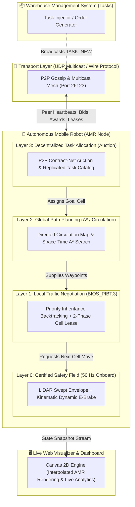
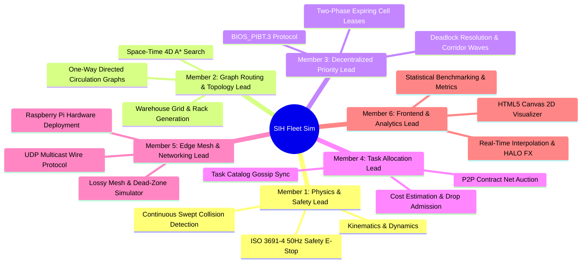
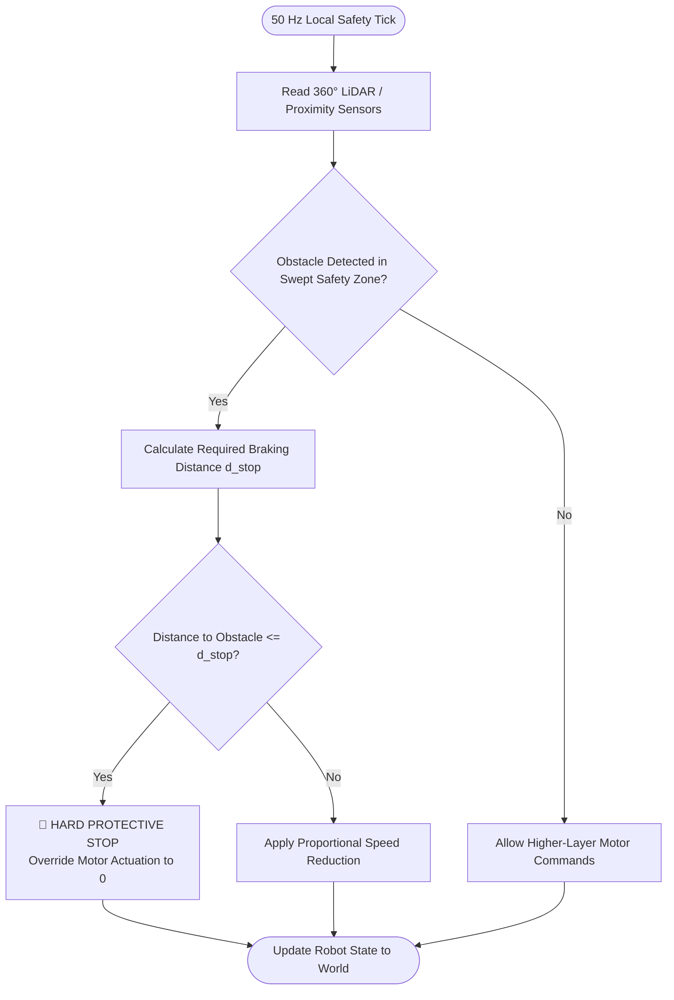
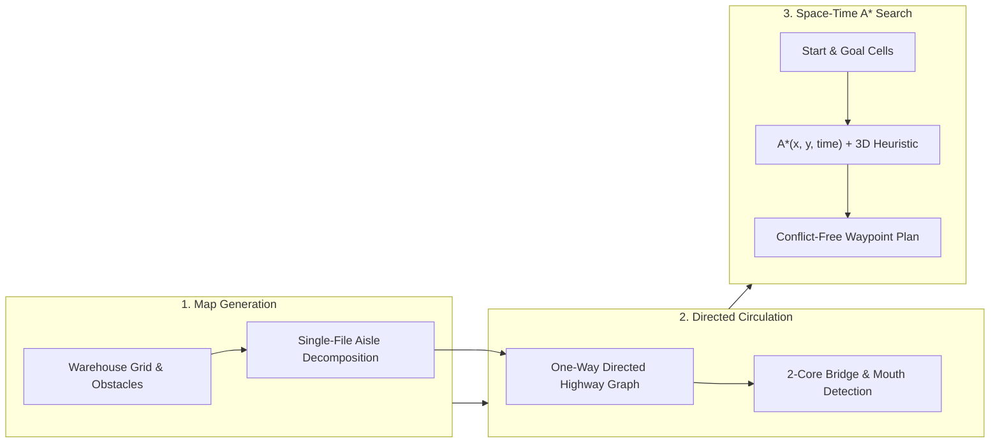
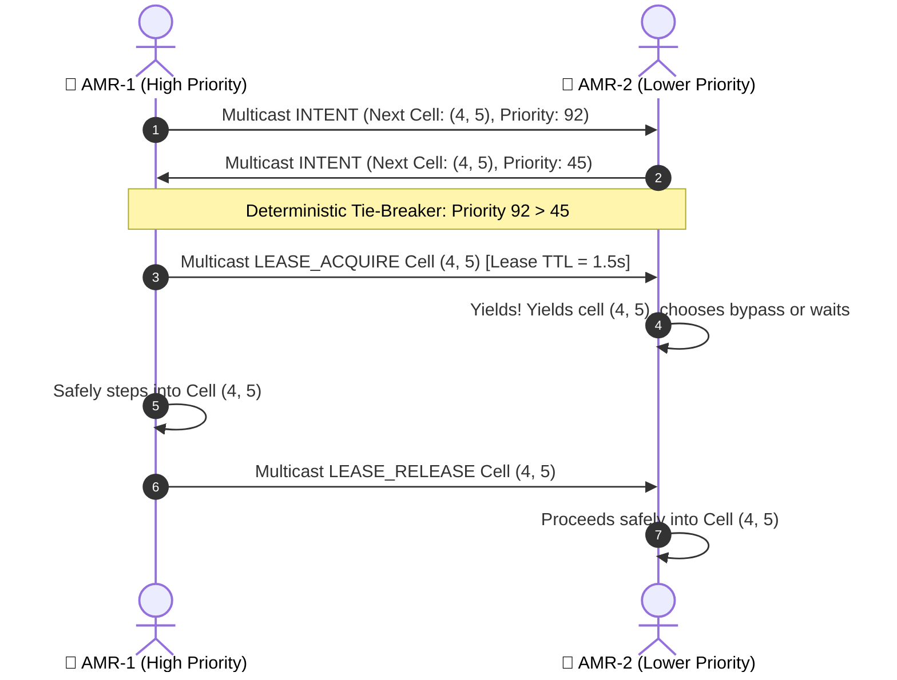
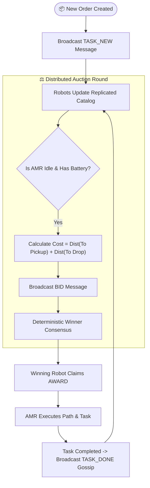
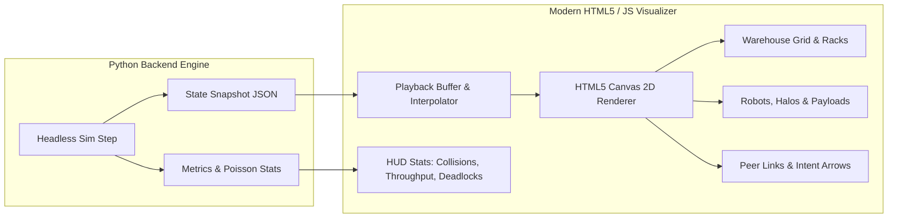

# 🚀 SIH_Fleet_Priority (SIH26123) — Complete Project Brief & 6-Member Work Breakdown Guide

> **Edge-AI Based Distributed Fleet Coordination for Autonomous Mobile Robots (AMRs) in Smart Warehouses**  
> **Problem Statement Owner:** Bharat Electronics Limited (BEL) | Software · Robotics and Drones  
> **Repository:** `SIH_Fleet_Sim`

---

## 📌 Executive Summary (What is this project?)

In modern automated warehouses (like Amazon or Flipkart), dozens of **Autonomous Mobile Robots (AMRs)** carry heavy pallets, shelves, and boxes between storage racks and packing stations. 

### 🛑 The Traditional Problem
Most commercial warehouses rely on a single **Central Fleet Manager Server**. 
- If that central server lags or loses Wi-Fi connection in a warehouse dead-zone, **the entire fleet freezes or collides**.
- Traditional simple algorithms (like "Stop-and-Wait") lead to severe **traffic gridlocks** and **deadlocks** in narrow corridors.

### 💡 Our Solution: Hybrid 3-Layer Hierarchical Edge Intelligence (`BIOS_PIBT.3`)
We built a state-of-the-art multi-robot simulation and peer-to-peer (P2P) protocol:
1. **Safety is Local & Certified (50 Hz):** The robot chassis has its own physical emergency brake that never relies on Wi-Fi (ISO 3691-4 compliant).
2. **Traffic is Peer-to-Peer (10 Hz):** When two robots meet at an intersection, they negotiate directly using an intelligent priority and cell-leasing algorithm (`BIOS_PIBT.3`) without asking a server.
3. **Tasks are Distributed (Auction Market):** New warehouse orders are auctioned among idle robots over peer multicast messages.
4. **Zero Third-Party Dependencies:** Pure Python standard library on the backend/simulation so it runs seamlessly on real bare-metal **Raspberry Pi edge computers**, paired with an ultra-smooth HTML5 Canvas visualizer frontend.

---

## 🏛️ High-Level System Architecture



---

## 👥 6-Member Team Division & Work Allocation

To successfully execute and scale this project, the entire system is divided into **6 distinct, specialized modules**. Each team member takes ownership of one module.



---

# 📘 Detailed Breakdown of the 6 Topics

---

## 🟢 Topic 1: Physics Engine, Kinematics & ISO 3691-4 Safety System (Layer 0)
**Responsible Team Member:** **Member 1 (Physics & Robotics Safety Lead)**  
**Core Files:** [`src/geometry.py`](file:///c:/Users/GAURAV/OneDrive/Desktop/SIH_Fleet_Sim-main/123/SIH_Fleet_Sim/src/geometry.py), [`src/world.py`](file:///c:/Users/GAURAV/OneDrive/Desktop/SIH_Fleet_Sim-main/123/SIH_Fleet_Sim/src/world.py), [`src/settings.py`](file:///c:/Users/GAURAV/OneDrive/Desktop/SIH_Fleet_Sim-main/123/SIH_Fleet_Sim/src/settings.py)

### 👶 Layman Explanation
Imagine driving a car. No matter how smart your GPS route is or what text message your friend sends you, if a pedestrian jumps in front of your bumper, your foot **immediately slams on the physical brake**. You don't wait for Wi-Fi or cloud permission to stop. 
Topic 1 handles the **physical real-world physics** of the AMR (speed, acceleration, turn rate, friction, carrying weight) and the **independent safety bubble** around the robot that operates at 50 times per second (50 Hz).

### ⚙️ What is Built & Key Responsibilities:
1. **Continuous Kinematics:** Differential/Bicycle drive robot motion modeling, linear velocity ($v \le 1.2\text{ m/s}$), angular acceleration, payload inertia.
2. **Swept Polygon Collision Detection:** Continuous collision checking between robot bodies, racks, walls, and moving warehouse workers (humans).
3. **ISO 3691-4 Certified E-Brake:**
   $$\text{Stopping Distance } d_{\text{stop}} = \frac{v^2}{2 \cdot a_{\text{brake}}} + v \cdot t_{\text{reaction}} + d_{\text{margin}}$$
   If any obstacle breaches this forward safety envelope, Layer 0 overrides everything and halts the chassis.



---

## 🟡 Topic 2: Warehouse Topology, Graph Routing & Space-Time Pathfinding (Layer 2)
**Responsible Team Member:** **Member 2 (Topology & Path Planning Lead)**  
**Core Files:** [`src/environment.py`](file:///c:/Users/GAURAV/OneDrive/Desktop/SIH_Fleet_Sim-main/123/SIH_Fleet_Sim/src/environment.py), [`src/topology.py`](file:///c:/Users/GAURAV/OneDrive/Desktop/SIH_Fleet_Sim-main/123/SIH_Fleet_Sim/src/topology.py), [`src/planner.py`](file:///c:/Users/GAURAV/OneDrive/Desktop/SIH_Fleet_Sim-main/123/SIH_Fleet_Sim/src/planner.py), [`src/fleet_manager.py`](file:///c:/Users/GAURAV/OneDrive/Desktop/SIH_Fleet_Sim-main/123/SIH_Fleet_Sim/src/fleet_manager.py)

### 👶 Layman Explanation
Think of a busy city with narrow streets. If every car is allowed to drive in both directions on any street, cars will inevitably meet nose-to-nose and get stuck forever. But if city planners make the streets **One-Way (Roundabouts & Loops)**, traffic flows continuously in a circle with zero head-on collisions. 
Topic 2 builds the **warehouse map layout**, turns narrow rack aisles into **one-way circulation highways**, and calculates the best A* route from start to destination.

### ⚙️ What is Built & Key Responsibilities:
1. **Warehouse Map Generator:** Generates grid cells, pickup/drop zones, rack rows, charging stations, and obstacles.
2. **Strongly-Connected Directed Circulation:** Decomposes bidirectional aisles into strongly connected one-way directed graphs where every cell can reach every other cell without head-on conflicts.
3. **Space-Time A\* Search ($x, y, \theta, t$):** Finds the optimal path not just in 2D space, but across time steps, avoiding reserved cells.
4. **Central Fleet Manager (Baseline):** Centralized global multi-robot path reservation system to benchmark against our decentralized approach.



---

## 🔴 Topic 3: Decentralized Priority & Conflict Resolution (Layer 1 - `BIOS_PIBT.3`)
**Responsible Team Member:** **Member 3 (Multi-Agent Priority & Traffic Algorithm Lead)**  
**Core Files:** [`src/priority.py`](file:///c:/Users/GAURAV/OneDrive/Desktop/SIH_Fleet_Sim-main/123/SIH_Fleet_Sim/src/priority.py), [`src/amr.py`](file:///c:/Users/GAURAV/OneDrive/Desktop/SIH_Fleet_Sim-main/123/SIH_Fleet_Sim/src/amr.py), [`docs/BIOS_PIBT_3_PROTOCOL.md`](file:///c:/Users/GAURAV/OneDrive/Desktop/SIH_Fleet_Sim-main/123/SIH_Fleet_Sim/docs/BIOS_PIBT_3_PROTOCOL.md)

### 👶 Layman Explanation
When two or more robots arrive at an intersection simultaneously, who goes first? Instead of an expensive traffic cop (central server), robots use a **courteous negotiation rule**:
- The robot carrying an urgent, high-priority payload or waiting the longest gets priority.
- Robots use **Priority Inheritance (PIBT)**: If robot A needs to move into a cell where robot B is standing, robot A "pushes" its priority onto robot B so robot B quickly moves out of the way.
- Robots take out a temporary **digital lease** on their next cell (like booking a meeting room for 2 seconds) so no two robots ever enter the same spot.

### ⚙️ What is Built & Key Responsibilities:
1. **Deterministic Lexicographic Priority:** Dynamic priority score based on $(-\text{Distance to Goal}, \text{Wait Time}, \text{Battery}, \text{Robot ID})$.
2. **Two-Phase Cell Leases:** AMRs broadcast an expiring claim on their destination cell; contenders resolve ties with frozen total ordering.
3. **Corridor Block Leases & Directional Waves:** In narrow bidirectional dead-ends, AMRs group tasks into batches moving in one direction before reversing the corridor flow.
4. **Invariant Repair / Anti-Deadlock:** Autonomous unsticking logic that recovers from packet loss or unexpected obstacles without human intervention.



---

## 🟣 Topic 4: Decentralized Task Allocation & Contract Net Auction (Layer 3)
**Responsible Team Member:** **Member 4 (Task Allocation & Market Mechanism Lead)**  
**Core Files:** [`src/assignment.py`](file:///c:/Users/GAURAV/OneDrive/Desktop/SIH_Fleet_Sim-main/123/SIH_Fleet_Sim/src/assignment.py), [`src/task_allocation.py`](file:///c:/Users/GAURAV/OneDrive/Desktop/SIH_Fleet_Sim-main/123/SIH_Fleet_Sim/src/task_allocation.py), [`src/messages.py`](file:///c:/Users/GAURAV/OneDrive/Desktop/SIH_Fleet_Sim-main/123/SIH_Fleet_Sim/src/messages.py), [`src/amr.py`](file:///c:/Users/GAURAV/OneDrive/Desktop/SIH_Fleet_Sim-main/123/SIH_Fleet_Sim/src/amr.py)

### 👶 Layman Explanation
When a customer orders an item online, a new warehouse job is created: "Pick up box at Shelf A and deliver to Drop Zone B". Which robot should do it?
Instead of a central dispatcher picking, it works like an **Automated Freelancer Auction**:
- The job is announced to all robots.
- Every idle robot calculates how much battery and travel time it would take them.
- They submit their bids over the mesh network. The robot with the lowest cost wins the job automatically, confirming with an expiring award lease.

### ⚙️ What is Built & Key Responsibilities:
1. **Replicated Task Catalog & Gossip:** Every robot keeps a synchronized local copy of pending tasks; missing tasks are shared via gossip messages.
2. **Decentralized Bounded Batch Auction:** 
   $$\text{Bid Cost} = A^*(\text{Robot} \to \text{Pickup}) + A^*(\text{Pickup} \to \text{Drop}) + \text{Battery Penalty}$$
3. **Drop Admission Control:** Prevents traffic bottlenecks by capping the number of robots heading to the same drop zone at any given time (max 2).
4. **Hungarian Matching Baseline:** Centralized optimal assignment algorithm implementation used for performance benchmarking.



---

## 🔵 Topic 5: Communication Mesh, Protocol & Network Fault Simulation
**Responsible Team Member:** **Member 5 (Networking & Edge Systems Lead)**  
**Core Files:** [`src/messages.py`](file:///c:/Users/GAURAV/OneDrive/Desktop/SIH_Fleet_Sim-main/123/SIH_Fleet_Sim/src/messages.py), [`src/transport.py`](file:///c:/Users/GAURAV/OneDrive/Desktop/SIH_Fleet_Sim-main/123/SIH_Fleet_Sim/src/transport.py), [`run.py`](file:///c:/Users/GAURAV/OneDrive/Desktop/SIH_Fleet_Sim-main/123/SIH_Fleet_Sim/run.py), [`backend/server.py`](file:///c:/Users/GAURAV/OneDrive/Desktop/SIH_Fleet_Sim-main/123/SIH_Fleet_Sim/backend/server.py)

### 👶 Layman Explanation
In real warehouses with metal racks and tall shelves, Wi-Fi has **dead zones** where packets get dropped, delayed, or lost. 
Topic 5 creates the **communications backbone**:
- It defines the compact JSON message formats sent over UDP Multicast (like walkie-talkies for robots).
- It provides a dual transport layer:
  - **In Simulation:** Simulates realistic packet drops (10%–30%), network latency, and Wi-Fi dead zones to test if our fleet survives tough conditions.
  - **On Real Hardware:** Opens real network sockets so physical Raspberry Pi robots can talk to each other without modifying a single line of code!

### ⚙️ What is Built & Key Responsibilities:
1. **P2P Wire Protocol:** Message schemas for `HEARTBEAT`, `INTENT`, `BID`, `AWARD`, `LEASE_ACQUIRE`, `LEASE_RELEASE`, `TASK_DONE`.
2. **Dual-Mode Transport Adapter:** Abstract transport interface supporting both headless in-memory simulated networks and real OS UDP Multicast sockets (`239.255.42.99:26123`).
3. **Network Fault Injection:** Realistic simulation of packet loss, range limits, packet jitter, and radio dead zones.
4. **Zero-Dependency Core:** Runs entirely on Python Standard Library (`socket`, `struct`, `json`, `math`) — zero `pip` dependencies needed for edge deployment.

```mermaid
sequenceDiagram
    autonumber
    participant AMR_A as 🤖 Robot Node A (Pi #1)
    participant Channel as 📡 Lossy Wireless Channel (UDP Multicast)
    participant AMR_B as 🤖 Robot Node B (Pi #2)

    AMR_A->>Channel: Heartbeat + Intent Packet
    alt Healthy Network Zone
        Channel->>AMR_B: Delivered in 2ms
        AMR_B->>AMR_B: Updates Peer State Table
    else In Wi-Fi Dead Zone (Simulated Drop)
        Channel--xAMR_B: Packet Dropped (Loss Model)
        Note over AMR_B: Heartbeat timeout triggers safe assumption; continues on local lease
    end
```

---

## 🎨 Topic 6: Full-Stack Web Visualizer, Real-Time Dashboard & Benchmark Analytics
**Responsible Team Member:** **Member 6 (Frontend UI/UX & Benchmark Metrics Lead)**  
**Core Files:** [`frontend/index.html`](file:///c:/Users/GAURAV/OneDrive/Desktop/SIH_Fleet_Sim-main/123/SIH_Fleet_Sim/frontend/index.html), [`frontend/css/style.css`](file:///c:/Users/GAURAV/OneDrive/Desktop/SIH_Fleet_Sim-main/123/SIH_Fleet_Sim/frontend/css/style.css), [`frontend/js/main.js`](file:///c:/Users/GAURAV/OneDrive/Desktop/SIH_Fleet_Sim-main/123/SIH_Fleet_Sim/frontend/js/main.js), [`frontend/js/amr.js`](file:///c:/Users/GAURAV/OneDrive/Desktop/SIH_Fleet_Sim-main/123/SIH_Fleet_Sim/frontend/js/amr.js), [`src/metrics.py`](file:///c:/Users/GAURAV/OneDrive/Desktop/SIH_Fleet_Sim-main/123/SIH_Fleet_Sim/src/metrics.py), [`src/scenarios.py`](file:///c:/Users/GAURAV/OneDrive/Desktop/SIH_Fleet_Sim-main/123/SIH_Fleet_Sim/src/scenarios.py)

### 👶 Layman Explanation
A great technical system needs a **jaw-dropping visual interface** to demonstrate to judges, stakeholders, and warehouse operators. 
Topic 6 builds the **real-time 2D simulation dashboard**:
- Smooth 60 FPS Canvas rendering of warehouse maps, moving robots with glowing status halos, human workers, payload boxes, and laser beams.
- Visual debug layers: Live P2P intent arrows, peer connection lines, and lease overlays.
- Statistical evaluation engine: Computes rigorous mathematical metrics (Poisson collision confidence intervals, throughput, makespan, energy consumption) to prove our algorithm beats traditional methods.

### ⚙️ What is Built & Key Responsibilities:
1. **High-Performance Canvas 2D Engine:** Multi-layered rendering (Grid layer, Obstacle layer, Robot layer, Network mesh overlay, Human worker animation).
2. **Smooth Interpolation:** Sub-pixel position interpolation between discrete simulation ticks for butter-smooth 60 FPS playback.
3. **Interactive Control Panel:** Controls for simulation speed (1x to 50x), scenario switching (`dense_aisles`, `chokepoint`, `dead_zone_mesh`), policy selection (`BIOS_PIBT.3`, `central`, `stop_and_wait`), and manual task injection.
4. **Scientific Metrics & Benchmarking:** Statistical logging of Poisson collision rates, wait times, retreat counts, and task completion throughput.



---

## 📊 Summary Responsibility Matrix

| # | Role & Specialty | Assigned Modules | Primary Deliverables | Key Files to Own |
|---|---|---|---|---|
| **1** | **Physics & Safety Lead** | Kinematics, Swept LiDAR, ISO 3691-4 E-Brake | 50Hz Safety Loop, Dynamic Braking Curves, Collision Geometry | `src/geometry.py`, `src/world.py`, `src/settings.py` |
| **2** | **Topology & Routing Lead** | Map Gen, Directed Circulation, Space-Time A* | One-Way Warehouse Graphs, 4D Pathfinding, Baseline Fleet Manager | `src/environment.py`, `src/topology.py`, `src/planner.py`, `src/fleet_manager.py` |
| **3** | **Decentralized Priority Lead** | `BIOS_PIBT.3`, 2-Phase Leases, Deadlock Breaking | PIBT Conflict Engine, Corridor Waves, Priority Scoring | `src/priority.py`, `src/amr.py` (traffic loop), `docs/BIOS_PIBT_3_PROTOCOL.md` |
| **4** | **Task Allocation Lead** | Contract Net Auction, Drop Admission, Task Gossip | Decentralized Bidding, Replicated Task Catalog, Cost Heuristics | `src/assignment.py`, `src/task_allocation.py`, `src/messages.py` |
| **5** | **Edge Mesh & Comms Lead** | UDP Multicast Protocol, Network Loss Simulation | Wire Protocol, Raspberry Pi Deployment, Dead-Zone Simulator | `src/messages.py`, `src/transport.py`, `run.py`, `backend/server.py` |
| **6** | **Frontend & Analytics Lead** | Canvas Visualizer, HUD Controls, Metrics Engine | 60FPS UI Dashboard, Intent Overlays, Benchmark Charts | `frontend/`, `src/metrics.py`, `src/scenarios.py` |

---

## 🛠️ How to Run & Verify the Entire Project Right Now

### 1. Start the Live Interactive Dashboard
```bash
python backend/server.py
```
👉 Open your browser at: **`http://127.0.0.1:8000`**

### 2. Run Headless Benchmarks with BIOS_PIBT.3
```bash
# Test 4 AMRs in dense aisles with decentralized auction allocation
python run.py --scenario dense_aisles --policy BIOS_PIBT.3 --allocation-policy auction --robots 4

# Test 24 AMRs stress test in wireless dead-zone mesh
python run.py --scenario dead_zone_mesh --policy BIOS_PIBT.3 --allocation-policy auction --robots 24 --seed 20 --duration 300
```

### 3. Run the Automated Test Suite (54 Unit & System Tests)
```bash
python -m pytest tests -q
```
