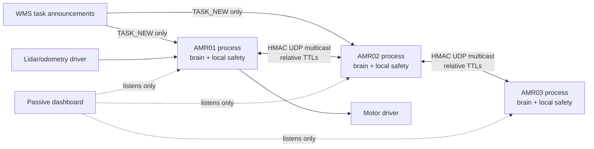

# Demonstration and judging script

## Five-minute live sequence

1. Start `python backend/server.py` and show `blocked_aisle` with `BIOS_PIBT.3`.
   Point out that the dropped pallet never broadcasts; onboard sensing promotes it to a
   temporary blocked cell and replans around it.
2. Show `human_in_aisle`. The worker is non-cooperative and never appears in peer
   messages. Pause on the safety halo and show the zero human-contact result.
3. Run `python edge_demo.py --robots 3 --duration 5 --port 26231` beside `tcpdump`.
   Show three PIDs, three unrelated clock epochs, authenticated peer traffic, and no
   central movement decision.
4. Run `python fault_campaign.py --seeds 3 --jobs 3 --no-write`. Explain the 0/5/10/20%
   loss sweep, partition healing, expired auction lease, and crashed-winner reassignment.
5. Open the checked-in acceptance JSON. State the exact limitation: the headline stress
   baseline is right-censored at 1200 s, so the reported reductions are conservative
   lower bounds, not exact makespan speedups.

## Architecture to explain

The dashboard is never in the command path. A peer packet is advisory; the local 50 Hz
protective-stop layer has final authority. The HMAC protects integrity/authenticity, the
session-scoped replay window rejects duplicates and old packets, and TTLs avoid assuming
that different devices share a monotonic clock epoch.

## Evidence checklist

- `python -m pytest -q`
- `python -m compileall -q src backend *.py`
- `find frontend/js -name '*.js' -print0 | xargs -0 -n1 node --check`
- `python benchmark.py --seeds 30 --jobs 8`
- `python fault_campaign.py --seeds 30 --jobs 8`
- Actual Pi/Jetson JSON report with model and OS recorded
- Packet capture showing multicast peers continue without the dashboard

Do not say “zero collisions are guaranteed.” Say “zero observed contacts in the stated
exposure, with the reported one-sided rate bound; local protective stop is independent
of radio agreement.”
